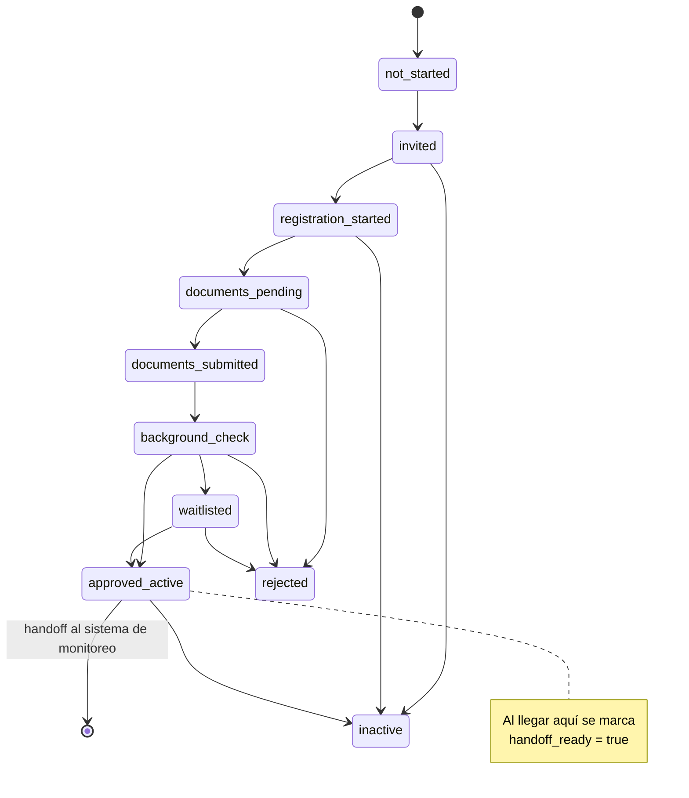
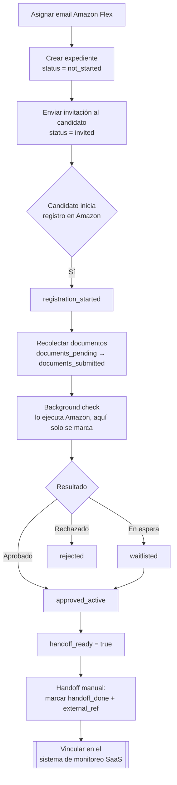
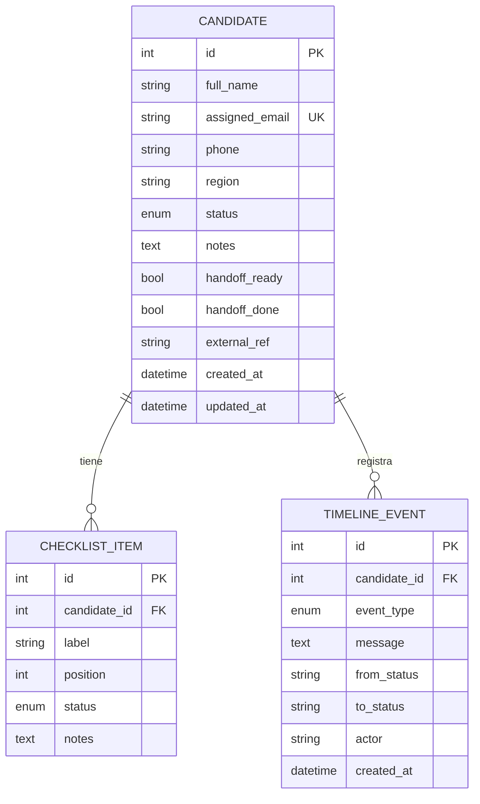

# Diagrama de flujo — Onboarding de conductores Amazon Flex

> **Alcance:** este sistema **solo hace tracking**. NO automatiza el registro en
> Amazon Flex ni los background checks. Registra el estado, checklist, timeline y
> el handoff (traspaso manual) al sistema de monitoreo.

## Máquina de estados del expediente

## Flujo del proceso (operativo)

## Modelo de datos

