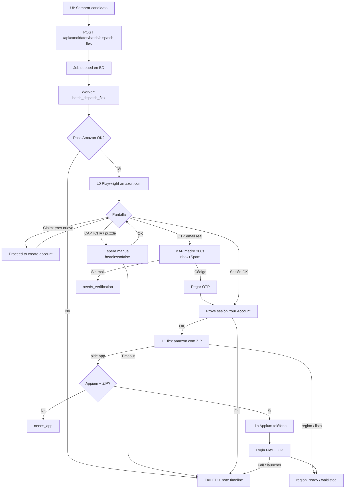

# Sembrar — Idea y flujo completo

Documento de referencia del **flujo automatizado “Sembrar”** en Flex Onboarding Manager (CRM SembradorFlex).

Relacionados:

- [`flex_apply.md`](./flex_apply.md) — setup Appium / outcomes
- [`imap_otp_gmail_forward.md`](./imap_otp_gmail_forward.md) — OTP con dominio → Gmail madre
- [`async_jobs.md`](./async_jobs.md) — cola de jobs
- [`flow.md`](./flow.md) — estados CRM / handoff (tracking general)

---

## 1. Idea (qué problema resuelve)

Queremos **crear cuentas Amazon + pedir región Flex** de forma repetible, usando emails del dominio propio (`*@cosecha.it.com`), **sin** subir datos personales (licencia, SSN, banco, background check).

| Rol | Qué hace |
|-----|----------|
| **CRM (este repo)** | Crea siembras (email + pass + ZIP), encola **Sembrar**, muestra resultado/timeline, evidencia |
| **Amazon.com (web)** | Cuenta usflex real (registro / login) |
| **Amazon Flex (app Android)** | Login + ZIP / región o lista de espera |
| **Operador humano** | CAPTCHA si aparece; docs personales **después** (fuera de Sembrar) |

**Regla de oro:** Sembrar **para antes** de documentos personales. Si L0 (cuenta Amazon) falla, **no** se abre Appium.

---

## 2. Arquitectura de correo (OTP)

```
Amazon ──OTP──► miami01@cosecha.it.com
                      │
                      │  Namecheap Email Forwarding (catch-all / alias)
                      ▼
              cosechaflex@gmail.com   ← “buzón madre” (IMAP App Password)
                      │
                      ▼
              CRM lee OTP por IMAP y lo pega en Playwright / Appium
```

- El email de la **siembra** es el de Amazon (`miami01@cosecha.it.com`).
- El CRM **nunca** inicia sesión IMAP como el alias; solo lee la **Gmail madre**.
- Un test válido de forward: enviar **desde otro correo** (p. ej. personal) → alias → debe llegar a la madre (`X-Original-To` / `Delivered-To`).
- Enviar desde la madre → alias → madre puede fallar por **anti-bucle**; no sirve como prueba.

Variables clave (`.env`):

```env
IMAP_OTP_ENABLED=true
IMAP_HOST=imap.gmail.com
IMAP_PORT=993
IMAP_MOTHER_EMAIL=cosechaflex@gmail.com
IMAP_MOTHER_PASSWORD=xxxx   # App Password de Google
IMAP_OTP_TIMEOUT_S=300      # espera OTP (poll cada IMAP_OTP_POLL_S)
IMAP_OTP_POLL_S=5
DEFAULT_SEED_DOMAIN=cosecha.it.com
```

---

## 3. Flujo Sembrar (paso a paso)



### L0 — Identidad Amazon (Playwright)

Archivos: `app/flex_creation/service.py`, `app/flex_apply/service.py`, `app/flex_apply/otp_flow.py`, `app/mailbox_imap.py`.

1. Validar contraseña (≥8, letras+números).
2. Intentar **registro** en Amazon.
3. Si aparece **“Looks like you're new…”** (`/ax/claim`) → *Proceed to create an account* (no es OTP).
4. Si pide **sign-in** (email ya existe) → login con mismo email/pass.
5. Si **CAPTCHA / “Solve this puzzle”** (`/ap/cvf/request`):
   - Con `FLEX_CREATION_HEADLESS=false` → espera hasta ~3 min a que el humano lo resuelva.
   - **No** se confunde con OTP ni se espera mail.
6. Si **OTP real** (campo código / texto “verification code”) → IMAP madre (Inbox + Spam), poll periódico.
7. **Probar sesión** en Your Account. Solo entonces L0 = OK.

### L1 — Región en web Flex

- Abre `flex.amazon.com`, intenta ZIP de la siembra.
- A menudo la web solo dice “usa la app” → `needs_app` y se pasa a Appium.

### L1b — Región en app (Appium)

Archivo: `app/flex_apply/appium_region.py`.

1. Preflight: Flex instalada y no crashea al abrir (teléfono real recomendado; emulador x86 suele fallar por ARM/`kHasAES`).
2. Despertar dispositivo, abrir Flex, login email/pass.
3. Si el **launcher/home** queda al frente → `activate_app` / relaunch.
4. ZIP + vehículo; detectar región OK / waitlist / OTP app.
5. **STOP** si aparecen pantallas de licencia / SSN / banco.

---

## 4. Outcomes → estado CRM

| Outcome | Significado | Estado típico |
|---------|-------------|---------------|
| `region_ready` | Región aceptada; listo para docs (manual) | `documents_pending` |
| `waitlisted` | Join list / sin cupo en ZIP | `waitlisted` |
| `needs_app` | Cuenta OK; falta Appium/ZIP/dispositivo | `registration_started` |
| `needs_verification` | OTP real sin código en buzón | `invited` |
| `failed` | Pass débil, CAPTCHA sin resolver, Appium, etc. | no cambia (note en timeline) |

---

## 5. Jobs async

- La UI **no bloquea**: `POST …/dispatch-flex` → `202` + `job_id`.
- Worker embebido (`FLEX_WORKER_EMBEDDED=true`) o `python -m scripts.flex_worker`.
- Poll: `GET /api/jobs/{id}` hasta `completed` / `failed`.
- Detalle: [`async_jobs.md`](./async_jobs.md).

---

## 6. Logs y evidencias

| Artefacto | Ruta |
|-----------|------|
| Pipeline por paso | `var/flex_apply/{email}_pipeline.log` |
| Screenshots / HTML | `var/flex_apply/{email}_{label}.png/.txt` |
| Appium XML | `var/flex_apply/{email}_*_app.xml` |
| Resumen en CRM | mensaje del job + note en timeline (incluye cola del pipeline) |

Ejemplo de líneas útiles en el log:

```
L0 claim: Looks like you're new → Proceed…
L0 CAPTCHA puzzle — resuélvelo en la ventana…
OTP IMAP wait hasta 300s … boxes=INBOX,[Gmail]/Spam
OTP IMAP poll#N left=… scanned=… amazonish=0
L1b package en primer plano=…
```

---

## 7. Stack y piezas

```
CRM FastAPI + SQLite/Postgres
    ├── Playwright (Chromium)     → amazon.com / flex.amazon.com
    ├── IMAP (Gmail madre)        → OTP
    └── Appium UiAutomator2       → Amazon Flex en Android
            └── adb + UDID teléfono
```

Módulos principales:

| Módulo | Rol |
|--------|-----|
| `app/flex_apply/service.py` | Orquesta L0 → L1 → L1b |
| `app/flex_creation/service.py` | Registro / login / claim / puzzle / prove |
| `app/flex_apply/otp_flow.py` | Detectar OTP web + pegar código |
| `app/mailbox_imap.py` | Poll IMAP madre / Spam |
| `app/flex_apply/appium_region.py` | Login + ZIP en app |
| `app/flex_apply/pipeline_log.py` | Log de pasos |
| `app/crud.py` + `job_runner.py` | Sembrar + cola |

---

## 8. Qué hay que instalar (setup completo)

Sin esto, Sembrar no funciona de punta a punta. Orden recomendado en **Windows**.

### 8.1 Software base

| Pieza | Para qué | Cómo |
|-------|----------|------|
| **Python 3.11+** | CRM + Playwright client + Appium client | [python.org](https://www.python.org/) (marca “Add to PATH”) |
| **Git** | Clonar / push docs | [git-scm.com](https://git-scm.com/) |
| **Node.js LTS** | Servidor **Appium** (`npm`) | [nodejs.org](https://nodejs.org/) |
| **Android SDK + `adb`** | Hablar con el teléfono | Android Studio → SDK Platform-Tools |
| **Teléfono Android real** (recomendado) | App Flex | USB + depuración USB; emulador x86 suele crashear Flex |

Variables de entorno del SDK (sesión o usuario):

```powershell
$env:ANDROID_HOME = "C:\Program Files (x86)\Android\android-sdk"   # o tu ruta Sdk
$env:ANDROID_SDK_ROOT = $env:ANDROID_HOME
$env:Path = "$env:ANDROID_HOME\platform-tools;$env:Path"
adb devices   # debe listar el UDID del teléfono
```

### 8.2 Repo CRM (Python)

```powershell
cd flex-onboarding-manager
python -m venv .venv
.\.venv\Scripts\activate
pip install -r requirements.txt
python -m playwright install chromium
```

`requirements.txt` incluye, entre otros: FastAPI, uvicorn, SQLAlchemy, Playwright, **Appium-Python-Client**, selenium, cryptography.

BD local típica:

```env
DATABASE_URL=sqlite:///./dev.db
```

Genera `CRED_KEY` (Fernet) si vas a guardar passwords de siembra:

```powershell
python -c "from cryptography.fernet import Fernet; print(Fernet.generate_key().decode())"
```

Arranque CRM:

```powershell
# o: .\run_local.ps1
python -m uvicorn app.main:app --host 127.0.0.1 --port 8080 --reload
```

Panel: http://127.0.0.1:8080/

### 8.3 Appium (Android)

Una vez (script del repo):

```powershell
.\scripts\setup_appium.ps1
```

Equivale a:

```powershell
npm install -g appium@3
appium driver install uiautomator2@4.2.9
```

Cada sesión de trabajo (otra terminal, con `ANDROID_HOME`):

```powershell
.\scripts\start_appium.ps1
# o: appium --address 127.0.0.1 --port 4723
```

En el teléfono:

1. Depuración USB ON; `adb devices` → `device`
2. Instalar **Amazon Flex** (Play Store o `adb install ….apk`)
3. Pantalla **desbloqueada** al Sembrar

Healthcheck: http://127.0.0.1:8080/api/meta/appium-status → `"ok": true`

### 8.4 Correo (OTP)

1. Namecheap (o DNS): forward `*@tudominio.com` → Gmail madre  
2. Gmail: 2FA + [App Password](https://myaccount.google.com/apppasswords)  
3. Probar: mail desde **otro** correo → `alias@tudominio.com` → llega a la madre  

### 8.5 `.env` mínimo para Sembrar

Copia `.env.example` → `.env` y ajusta:

```env
DATABASE_URL=sqlite:///./dev.db
CRED_KEY=...tu_fernet...

FLEX_CREATION_ENABLED=true
FLEX_CREATION_HEADLESS=false
FLEX_CREATION_TIMEOUT_MS=120000

FLEX_APPIUM_ENABLED=true
FLEX_APPIUM_SERVER_URL=http://127.0.0.1:4723
FLEX_APPIUM_DEVICE_NAME=Android Phone
FLEX_APPIUM_UDID=baed3e4b0604
FLEX_APPIUM_ADB_EXEC_TIMEOUT_MS=120000
FLEX_APP_PACKAGE=com.amazon.flex.rabbit
FLEX_APP_ACTIVITY=com.amazon.rabbit.android.presentation.core.LaunchActivity
FLEX_DEFAULT_VEHICLE_TYPE=Sedan

FLEX_WORKER_EMBEDDED=true

IMAP_OTP_ENABLED=true
IMAP_HOST=imap.gmail.com
IMAP_PORT=993
IMAP_MOTHER_EMAIL=tu_gmail_madre@gmail.com
IMAP_MOTHER_PASSWORD=xxxx-xxxx-xxxx-xxxx
IMAP_OTP_TIMEOUT_S=300
IMAP_OTP_POLL_S=5

DEFAULT_SEED_DOMAIN=cosecha.it.com
```

> **Emulador x86:** Flex ARM suele morir con `kHasAES`. Prefiere **teléfono real**.

Más detalle Appium: [`flex_apply.md`](./flex_apply.md).

### 8.6 Checklist rápido antes de Sembrar

1. Forward dominio → Gmail madre OK  
2. App Password IMAP en `.env`  
3. `uvicorn` en `:8080`  
4. Appium en `:4723` + `adb devices`  
5. Flex instalada, móvil desbloqueado  
6. Siembra con ZIP + pass ≥8 (letras+números)  
7. `FLEX_CREATION_HEADLESS=false` si hay CAPTCHA  

---

## 9. Qué NO hace Sembrar

- No sube licencia, SSN, seguro ni datos bancarios.
- No resuelve CAPTCHA solo (espera humano o falla).
- No es el “Monitor SaaS”; el CRM solo trackea y hace handoff cuando corresponda.
- No garantiza éxito si Amazon cambia UI / rate-limita / bloquea el IP.

---

## 10. Principios de diseño

1. **Email de siembra = identidad Amazon**; Gmail madre = solo buzón de llegada.
2. **Clasificar pantallas** antes de actuar: claim ≠ puzzle ≠ OTP ≠ login.
3. **No avanzar a Appium** sin L0 autenticado de verdad.
4. **Evidencia siempre**: log + screenshot ante fallo.
5. **Jobs async** para no colgar el panel web.

---

*Última actualización: flujo L0 claim/CAPTCHA/OTP + L1 web + L1b Appium + IMAP 300s Inbox/Spam + sección de instalación completo.*
